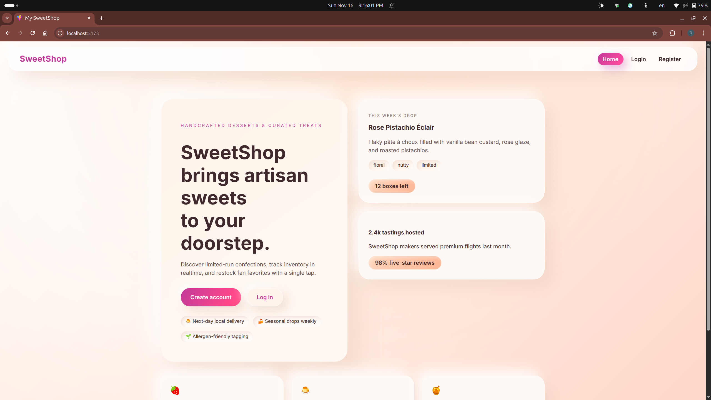
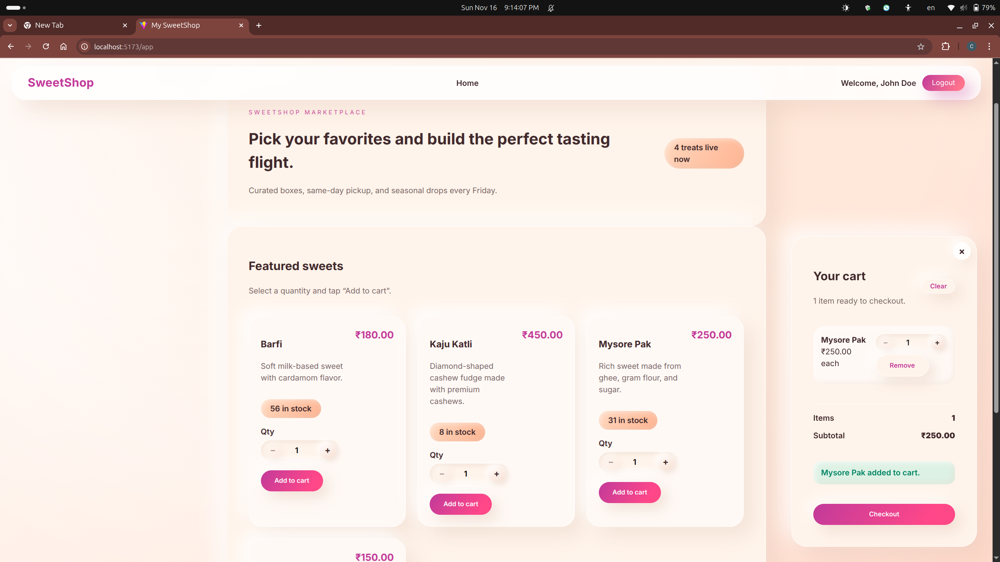
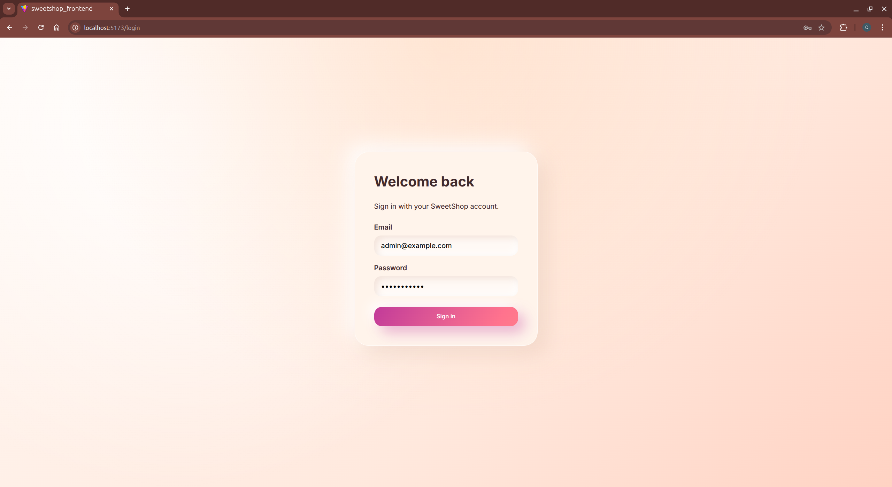
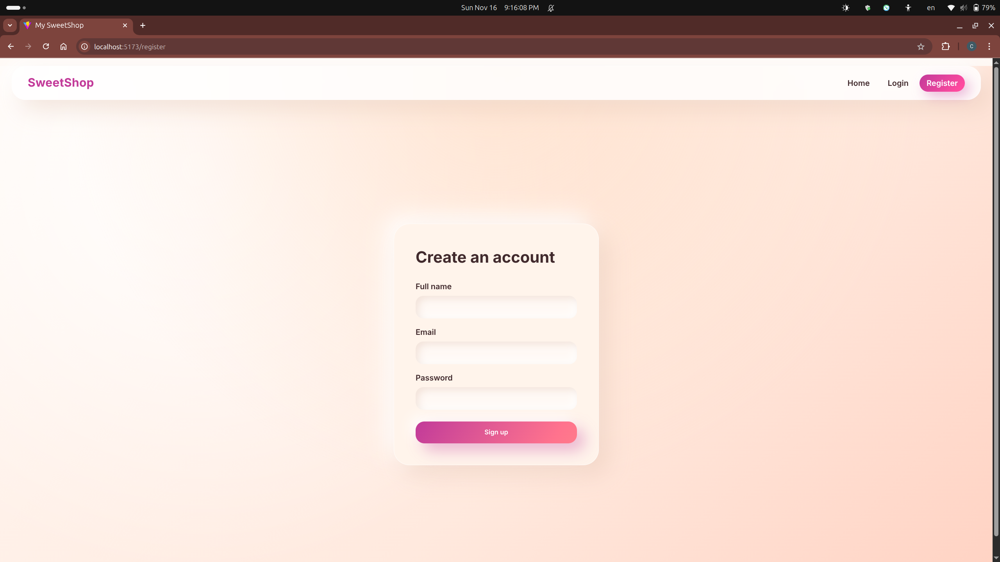
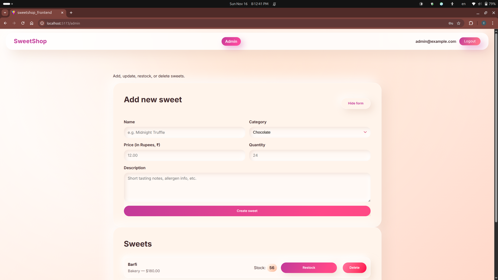

# SweetShop Frontend

Modern React/Vite interface for the SweetShop marketplace. Customers can explore curated sweets, manage carts with realtime stock feedback, and admins can maintain the catalog with restock + delete workflows. Auth is JWT-backed and routing is fully guarded for customer/admin roles.

## Table of contents

1. [Features](#features)
2. [Screenshots](#screenshots)
3. [Tech stack](#tech-stack)
4. [Project structure](#project-structure)
5. [Getting started](#getting-started)
6. [Available scripts](#available-scripts)
7. [Testing](#testing)
8. [Configuration](#configuration)
9. [Development tips](#development-tips)
10. [My AI Usage](#my-ai-usage)

## Features

- 🔐 **JWT auth + routing guards** – Login/register flows feed the `AuthContext`, routing denies admins/customers from the wrong surfaces.
- 🛒 **Persistent cart experience** – Cart state hydrates from `localStorage`, enforces inventory maxes, and provides a floating checkout panel.
- 🧁 **Customer marketplace** – Responsive dashboard highlights seasonal sweets, quantity steppers, and stock chips.
- 🛠️ **Admin operations** – CRUD tooling for sweets, restock helpers, and confirmation prompts.
- 🧪 **Robust testing** – Vitest + MSW simulate API responses for auth flows and refresh logic.

## Screenshots

| Landing | Customer Dashboard | Auth Screens |
| --- | --- | --- |
|  |  |  |

| Registration | Admin Panel |
| --- | --- |
|  |  |

## Tech stack

- React 19 + Vite 7
- React Router DOM 7
- Axios with automatic JWT refresh
- React Context for auth + cart state
- Vitest, MSW, Testing Library

## Project structure

```
src/
  App.jsx           # Routes + shared shell
  App.css           # Neumorphic theme + components
  components/       # Reusable UI (AuthNav, etc.)
  contexts/         # Auth + cart providers
  lib/api.js        # Axios client + helpers
  pages/            # Feature screens (landing, dashboard, admin...)
  __tests__/        # Vitest suites backed by MSW
```

## Getting started

```bash
# 1. Install dependencies
npm install

# 2. Run the development server
npm run dev

# 3. (Optional) point to a different backend
echo "VITE_API_BASE_URL=https://sweetshop.example.com/api/" > .env.local
```

Visit http://localhost:5173 to view the app. The dev server automatically proxies asset updates and fast-refreshes React components.

## Available scripts

| Script | Description |
| --- | --- |
| `npm run dev` | Launch Vite dev server with hot reload. |
| `npm run build` | Production build (ESM output in `dist/`). |
| `npm run preview` | Serve the build locally for smoke testing. |
| `npm run lint` | Run ESLint across the source tree. |
| `npm exec vitest run` | Execute the Vitest suite once (see [Testing](#testing)). |

## Testing

Vitest is configured with the happy-dom environment plus MSW handlers. Run the suite with:

```bash
npx vitest run --environment happy-dom
```

Add `--watch` for red/green TDD loops during development.

## Configuration

| Variable | Default | Notes |
| --- | --- | --- |
| `VITE_API_BASE_URL` | `http://127.0.0.1:8000/api/` | Include the trailing slash. Used by `lib/api.js` for every request. |

Place overrides in `.env.local` (auto-loaded by Vite) or export them in your shell before running `npm run dev`.

## Development tips

- Use the `CartProvider` hooks (`addItem`, `updateItemQuantity`, etc.) rather than duplicating cart logic.
- `lib/api.js` centralizes axios interceptors; always import helpers from there instead of instantiating new clients.
- When modifying routing, update both `App.jsx` (for layout) and any guard components in `AuthContext.jsx`.
- Friendly UI tweaks live in `App.css`; global variables/gradients remain in `index.css`.

## My AI Usage

- **Tools used:** GitHub Copilot (inline completions + diff suggestions) and ChatGPT (natural-language planning + README drafting).
- **How they helped:** Copilot generated scaffolding for UI components (AuthNav, cart panel tweaks) and suggested test stubs, while ChatGPT acted as a pair-programmer to plan refactors, tighten copy, and produce this comprehensive README.
- **Reflection:** AI helps me build this frontend so quickly even though I have almost no experience in frontend.It's a great tool that increase my productivity while I focus on how the app should work.
